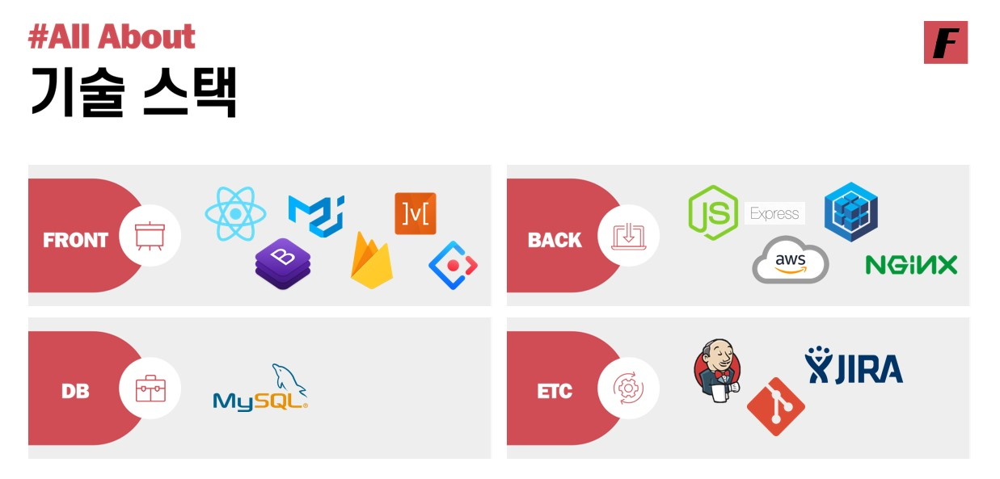
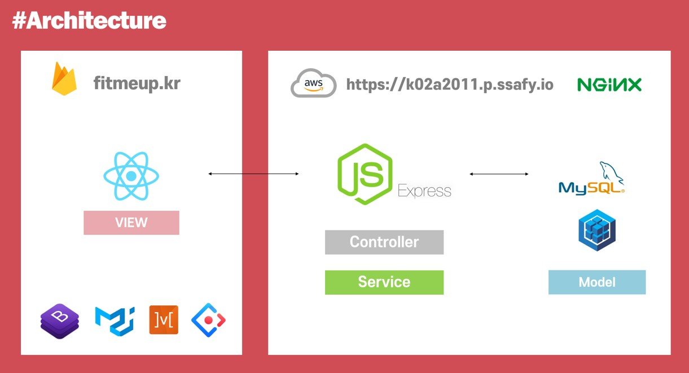
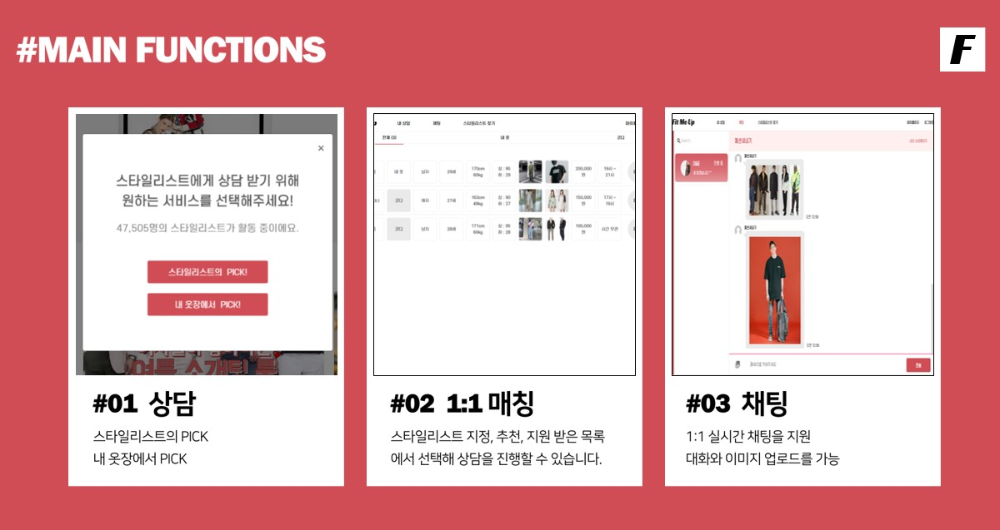

# Fit Me Up

<br/>

## [목차]

1. [How to run](##1.-how-to-run)
2. [서비스 소개](##2.-서비스-소개)
3. [서비스 설명](##3.-서비스-설명)
4. [개발 과정](##4.-개발-과정)
5. [팀원 소개](##5.-팀원-소개)

<br/>

## 1. How to run

<h4>접속 URL, 테스트 계정</h4>


<h4>개발 환경</h4>

**Frontend**

```
cd frontend
yarn install
yarn start
```

<br/>**Backend**

```
cd backend
npm install
npm start
```

<br/>

<h4>기술 스택</h4>





* frontend : React.js
* Backend : Nodejs
* DB : Mysql

<br/>

## 2. 서비스 소개

- 맞춤형 코디 서비스가 필요한 고객과 서비스를 제공하는 핏미업 스타일리스트를 쉽고 빠르게 연결해드리는 코디 전문가 매칭 서비스입니다.

- 1분 내외의 상담 요청서를 작성하면, 여러 스타일리스트가 맞춤형 상담 연락을 드립니다.

- 맘에 쏙 드는 스타일리스트의 맞춤형 코디 상담을 받아볼 수 있습니다.

<br/>

## 3. 서비스 설명

1. 상담 서비스
2. 매칭 시스템
3. 실시간 채팅
4. 스타일리스트의 포트폴리오
5. 스타일리스트 마이페이지를 통한 상담, 수익 분석



<br/>

## 4. 개발 과정

<h4>git branch 구조</h4>

* master
  * dev
    * front
      * front-login
      * front-search
    * back
      * back-login
      * back-search

<br/>

<h4>Commit Rule</h4>

```
날짜 | 내용(영어로) | 이름(DE, 대문자), (JIRA 이슈번호)
0506 | update readme | DE, (JIRA 이슈번호)
```

<br/>

## 5. 팀원 소개

<br/>